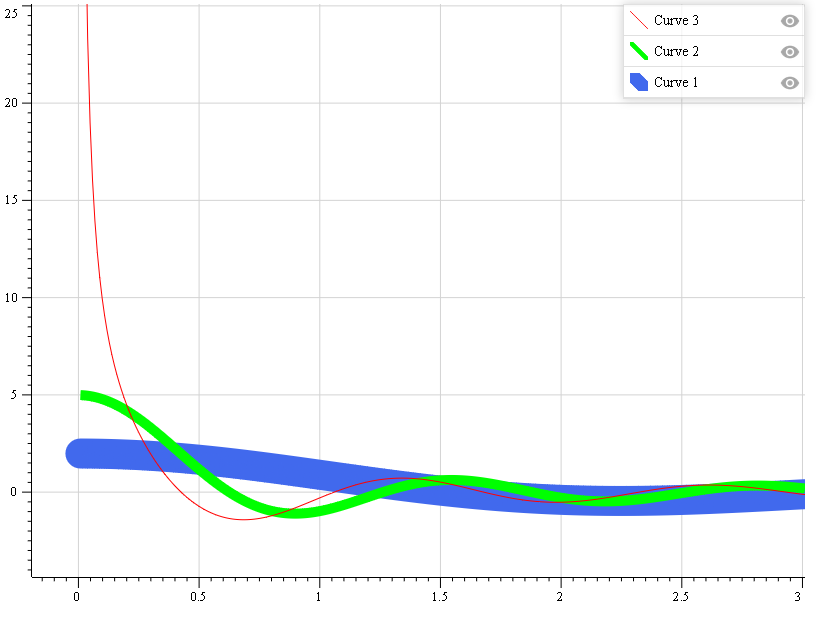

# F# API for Interactive Data Display


| Platform | Version | Downloads |
| -- | -- | -- |
| .NET | [](https://www.nuget.org/packages/FSharpIDD/) | [](https://www.nuget.org/packages/FSharpIDD/) |
| Web Sharper | [](https://www.nuget.org/packages/FSharpIDD.WS/) | [](https://www.nuget.org/packages/FSharpIDD.WS/) |

Provides a way to compose a chart in F# and easily get embeddable HTML presenting this chart.

## Usage example

Generating some data series to show

```F#
let Xseries = Array.init 1000 (fun i -> float(i+1)*0.01)

let Yseries1 = Xseries |> Array.map (fun x -> sin(2.0*x)/x)
let Yseries2 = Xseries |> Array.map (fun x -> sin(5.0*x)/x)
let Yseries3 = Xseries |> Array.map (fun x -> sin(5.0*x+1.0)/x)           
```

Specifing plots to draw

```F#
// Specifying some of the polyline options with setOption call
let curve1 =
    createPolyline Xseries Yseries1
    |> setOptions (Options(Name = "Curve 1", Thickness = 30.0, LineCap=LineCap.Round))    
// Specifying some of the polyline options with a series of set... calls
let curve2 = 
    createPolyline Xseries Yseries2        
    |> setName "Curve 2"
    |> setStrokeColour Colour.Green
    |> setThickness 10.0        
// Specifying some of the polyline options with a record recreation
let curve3 = createPolyline Xseries Yseries3
let curve3 =
    {
         curve3 with
            Name = "Curve 3"
            Colour = Colour.Red
    }
// combining all 3 curves in one chart
let chart =
    Chart.Empty
    |> Chart.addPolyline curve1
    |> Chart.addPolyline curve2
    |> Chart.addPolyline curve3
```

Getting embeddable HTML is as easy as 
```F#
let generatedHTML = chart |> toHTML
```

The result will look like


See **Demo.Net** project for the runnable sample.
